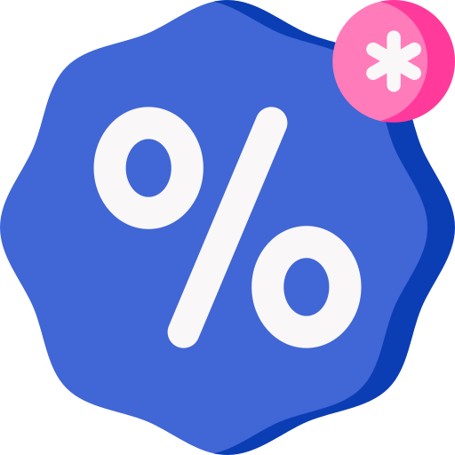

<p align="center">
  
</p>

<h1 align="center">Droppr</h1>

<p align="center">
  <strong>The smartest way to track prices across any online store.</strong><br/>
</p>

<p align="center">
  A full-stack price drop tracker built with Next.js 16, Firebase, and Puppeteer.<br/>
  Paste a product URL and Droppr tracks the price every 6 hours via GitHub Actions,<br/>
  then sends an email alert the moment your threshold is met.
</p>

<p align="center">
  
  
  
  
</p>

---

## Features

- **Universal price scraping** via Puppeteer with stealth plugin and a 4-stage extraction pipeline
- **Smart currency detection** supporting DKK, NOK, SEK, EUR, GBP, USD and more
- **European number parsing** handles formats like `1.299,00 kr` correctly
- **Liquid glass UI** with aurora animated landing page and macOS-style floating dock
- **Watchlists** to organise tracked items into categorized lists with live item counts
- **Deals page** showing all items currently below their recorded high
- **Price history charts** with sparkline trend visualization
- **Configurable alerts** by fixed price or percentage drop
- **Email notifications** via Resend when an alert triggers
- **Automated checks** every 6 hours via GitHub Actions at no cost
- **Real-time UI** powered by Firestore `onSnapshot` listeners
- **Auth** with email/password and Google OAuth via Firebase

---

## Tech Stack

| Layer | Technology |
|---|---|
| Framework | Next.js 16.2.6 (App Router) |
| Language | TypeScript (strict) |
| Styling | Tailwind CSS v4 |
| UI Primitives | Radix UI (Dialog, Tooltip) |
| Animations | Framer Motion v12 |
| Forms | React Hook Form + Zod |
| Auth | Firebase Auth |
| Database | Firebase Firestore |
| Scraping | Puppeteer Core + puppeteer-extra-stealth |
| Chromium (prod) | @sparticuz/chromium-min |
| Scheduler | GitHub Actions |
| Email | Resend |
| Charts | Recharts |
| Toasts | Sonner |
| Deployment | Vercel |

---

## Prerequisites

- Node.js 20+
- Firebase project with Auth and Firestore enabled
- Resend account (free tier: 3,000 emails/month)
- Vercel account
- GitHub repository (for Actions scheduling)

---

## Local Development

### 1. Clone and install

```bash
git clone https://github.com/hazavi/droppr.git
cd droppr
npm install
```

### 2. Configure Firebase

1. Create a new project in the [Firebase Console](https://console.firebase.google.com)
2. Enable **Authentication** with Email/Password and Google providers
3. Enable **Firestore Database** in production mode
4. Copy your web app config from Project Settings

### 3. Set Firestore Security Rules

Go to **Firestore Database > Rules** and paste:

```
rules_version = '2';
service cloud.firestore {
  match /databases/{database}/documents {

    // User profile document
    match /users/{userId} {
      allow read, write: if request.auth != null && request.auth.uid == userId;
    }

    // All subcollections under a user (lists, items, etc.)
    match /users/{userId}/{document=**} {
      allow read, write: if request.auth != null && request.auth.uid == userId;
    }

    // collectionGroup queries on "items" (for dashboard/deals views)
    match /{path=**}/items/{itemId} {
      allow read: if request.auth != null && resource.data.userId == request.auth.uid;
      allow write: if request.auth != null && request.resource.data.userId == request.auth.uid;
    }

  }
}
```

> The `collectionGroup` rule is required for the dashboard and deals pages, which query across all lists using `collectionGroup("items")`.

### 4. Configure environment variables

```bash
cp .env.local.example .env.local
```

| Variable | Description |
|---|---|
| `NEXT_PUBLIC_FIREBASE_API_KEY` | Firebase web API key |
| `NEXT_PUBLIC_FIREBASE_AUTH_DOMAIN` | Firebase auth domain |
| `NEXT_PUBLIC_FIREBASE_PROJECT_ID` | Firebase project ID |
| `NEXT_PUBLIC_FIREBASE_STORAGE_BUCKET` | Firebase storage bucket |
| `NEXT_PUBLIC_FIREBASE_MESSAGING_SENDER_ID` | Firebase messaging sender ID |
| `NEXT_PUBLIC_FIREBASE_APP_ID` | Firebase app ID |
| `RESEND_API_KEY` | Resend API key |
| `SCRAPER_SECRET` | Protects the `/api/scrape` route |
| `CRON_SECRET` | Protects the `/api/cron/check-prices` route |

### 5. Run the dev server

```bash
npm run dev
```

---

## Deployment

1. Push to GitHub
2. Import the repo in [Vercel](https://vercel.com)
3. Add all environment variables under Project Settings
4. Deploy

---

## GitHub Actions

The workflow at `.github/workflows/check-prices.yml` calls `/api/cron/check-prices` every 6 hours.

Add these secrets under **Settings > Secrets and variables > Actions**:

| Secret | Value |
|---|---|
| `APP_URL` | Your Vercel production URL |
| `CRON_SECRET` | Same value as `CRON_SECRET` in Vercel |

---

## Scraper

Prices are extracted using a 4-stage pipeline:

1. CSS selectors (`data-testid`, `itemprop="price"`, `data-price`, common class names)
2. JSON-LD structured data (Schema.org `Product` / `Offer`)
3. DOM text scan across leaf elements (catches SPAs with generated class names)
4. Open Graph product meta (`product:price:amount`, `product:price:currency`)

To add support for a new site, add its selector to `PRICE_SELECTORS` in `lib/scraper.ts`.

### Site Blocking

Some retailers (e.g. H&M via Akamai Bot Manager) block automated browsers entirely. When this happens you will see:

> **"This site is blocking automated access. Try a different retailer or paste the price manually."**

There is no workaround without residential proxies. Sites requiring login are also not supported.

---

## License

MIT